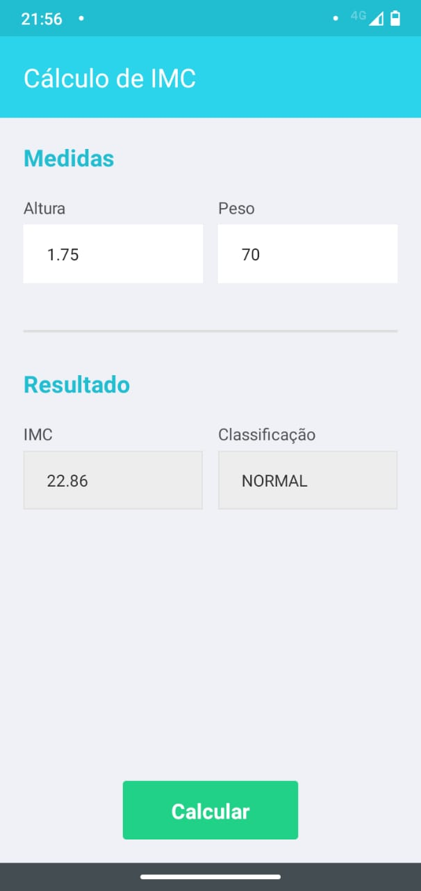

# Atividade 1 da disciplina de Mobile

## Criar um formulário com título, 4 campos e 1 botão:

- Título: Cálculo de IMC
- Input 1: Altura (em cm)
- Input 2: Peso (em kg)
- Botão: Calcular
- Input 3: IMC
- Input 4: Classificação

Calcular o IMC de acordo com os valores nos inputs 1 e 2, e apresentar os resultados nos inputs 3 e 4.
Validar para que os campos sejam preenchidos com um Alert.

- Fórmula do IMC = peso / altura²

## Tabela de Classificação:

### IMC CLASSIFICAÇÃO

- MENOR QUE 18,5 MAGREZA
- ENTRE 18,5 E 24,9 NORMAL
- ENTRE 25,0 E 29,9 SOBREPESO
- ENTRE 30,0 E 39,9 OBESIDADE
- MAIOR QUE 40,0 OBESIDADE GRAVE

# React Native

Projeto criado com React Native e Expo

# Preparando o ambiente

## Dependências

Para iniciar o projeto é necessário instalado em sua máquina o [NodeJS](https://nodejs.org/pt-br/) e o [Expo CLI](https://docs.expo.io/workflow/expo-cli/) nas dependências globais do Node.

- Usando **npm**

```bash
$ npm install
```

- Usando **yarn**

```bash
$ yarn install
```

## Iniciando o servidor

- Usando o próprio **expo**

```bash
$ expo start
```

- Usando **npm**

```bash
$ npm run start
```

- Usando **yarn**

```bash
$ yarn start
```

# Print do Projeto


